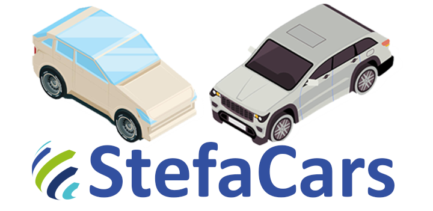

### Desafio Hackathon Stefanini
### StefaCars é um sistema de corrida onde jogadores disputam corridas acirradas em busca dos melhores carros. Vença corridas e conquiste seu lugar no podium. 

# Objetivos Principais:
- **Consertar os diversos bugs que estão na aplicação;**


- **Desenvolver um sistema que obedeça as boas práticas de programação;**
  - Root da api deve ser a url ‘/api’; ex: localhost:8080/api/…
  - Os end-points devem obedecer aos verbos HTTPs corretos;  
  - Princípio da responsabilidade única;


- **Criar a entidade Jogador com os atributos: (↓ Detalhes na sessão de tabelas ↓)**
  - Nickname:
    - Deve ser único;
  - Senha:
    - Deve ser criptografada;
    - Tamanho mínimo de 4 caracteres;
    - Tamanho máximo de 10 caracteres;
  - Carro: (Tabela especificada no final da folha)
  - Saldo: 
    - Campo de valor inteiro;
    - Valor padrão para novos jogadores = 100

  
- **Criar funcionalidade de cadastro de Jogador;**
  - CRUD completo;
  

- **Criar funcionalidade de login que valide o nickname e senha salvos no banco de dados;**


- **O sistema deverá apresentar a lista de carros e o jogador deverá escolher 1 carro para jogar;**
  - Pode ser feito na hora de cadastro ou após o primeiro login


- **Criar uma funcionalidade de Corrida, poderá ser implementada como quiser respeitando os seguintes critérios:**
  - A corrida deve ser composta aleatoriamente pelos jogadores cadastrados no sistema, caso não haja jogadores suficientes, a corrida deverá ser completada por ‘bots’
  - Não poderá haver empate, a lógica da corrida deverá indicar um vencedor.
  - Apresentar os 3 primeiros colocados de uma corrida;
  - Deverá ser utilizado pelo menos 1 atributo do carro além do obrigatório.
  - Somente jogadores cadastrados poderão fazer corrida;

# Objetivos Extras:
- Possibilitar a troca/compra de novos carrinhos;
- Apresentar um LOG da corrida;
- Criar uma lógica de ganho de moedas em cada corrida (valores inteiros);
- Implementar os circuitos na lógica da corrida

---

# Tabelas:
- ### **Jogador:**
  - id
  - nickname
  - senha 
  - id_carro
  - saldo 

## Tabelas de domínio (apenas leitura):
- ### **Carro:**
  - id
  - Nome
  - Preço
  - Velocidade (atributo obrigatorio para Corrida)
  - Força/Torque
  - Aceleração
  - Drift/Derrapagem/Frenagem
  - Controle


- ### **Circuito:**
  - id
  - nome
  - percurso
  - voltas
  - curvas
  - foto
  

  <br>

---
# Arquitetura do projeto

### Pré-Requisitos *obrigatórios*:
- JDK 11+
- Maven 3.8.1
- MySql/MariaDB

### Pré-Requisitos *opcionais*:
- Docker (Caso queira usar o mysql que tem no projeto)
- Docker Compose (Normalmente vem com o docker)

## Rodar a aplicação em modo de desenvolvimento

## Maven
**Lembrando que precisa do **MySQL** já está rodando e com a base stefacars criada!**<br/>

Use o seguinte comando para iniciar o servidor:<br/>
<small>Obs: Esse comando deve ser executado na _raiz_ do projeto!</small>
```shell script
./mvnw clean compile quarkus:dev
```

## Docker (Opcional)
**Lembrando que esses comando são no terminal dentro da pasta _"./src/main/docker"_**
<br/><br/>
E caso queira usar o MySQL no docker:<br/>
<small>Obs: Não use o "-d" caso queira que o terminal do docker fique aberto.</small>
```
docker-compose up -d 
```
<br/>

E para parar o MySQL no docker:<br/>
<small>Obs: Não precisa caso não tenha usado o "-d"</small>
```
docker-compose down
```

#### Alguns guias relacionados:
- Maven ([guia](https://maven.apache.org/what-is-maven.html))
- Hibernate ORM (Implementação do JPA) ([guia](https://docs.jboss.org/hibernate/orm/current/userguide/html_single/Hibernate_User_Guide.html))
- RESTEasy JAX-RS ([guia](https://docs.jboss.org/resteasy/docs/3.0.9.Final/userguide/html_single/index.html))
- MySQL ([guia](https://dev.mysql.com/doc/))

Opcionais:
- Docker([guia](https://docs.docker.com/))
